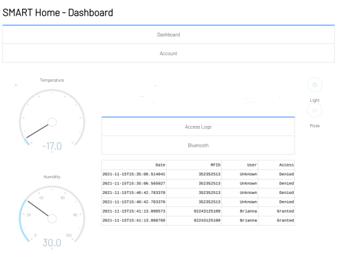
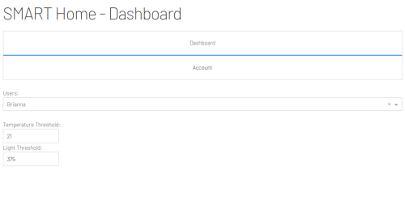

# IoT Dashboard - Smart Panda Home

## What is it?
This project is made under the guise of a final assignment for out IoT class at Vanier College. It uses Raspberry Pi, and three NodeMCU ESP8266, to form a makeshift smart home application. 

## Dashboard Images

## Features
- A DHT11 allowed for real-time temperature and humidity readings.
- An RFID reader allowed for user identification, and system personalization with temperature and light threshold.
- A photoresistor allowed for the creation of an automatic lighting system.
- The Raspberry Pi's built in Bluetooth allowed for scanning of surrounding Bluetooth devices.
- An email server allowed to send emails to the admin allowing them to control a DC motor, which acted as a fan, when the temperature was above the user given threshold.
- and More...

&copy; [Herbert Domingo](https://github.com/Dahyunismm), [Brianna Simon](https://github.com/Brianna1915403), and [Seungwon Park](https://github.com/ParkSeung1)